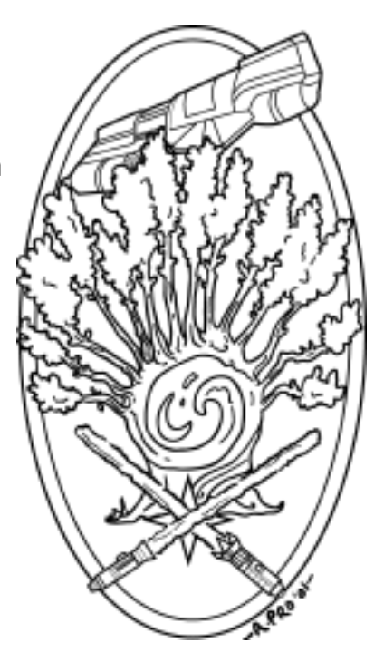

An article by Morrie Mullins, RPGA Living Force Campaign Designer/Plot Director.

**From the Office of Thurm Loogg Metatheran Cartel Representative, Cularin**

The public relations debacle that led to the death of my predecessor, Velin Wir, and the expulsion of the Metatheran Cartel from the planet of Cularin served as the culmination of a great many unfortunate events. I cannot emphasize enough how very sorry the Cartel is for everything that occurred. It was certainly never our intention to cut the most sacred and beautiful ch'hala trees that grow at multiple undisclosed locales deep within your jungles. Nor was it ever our intention to violate our trade charters, in even the minor ways my predecessor deemed appropriate.

No, the Cartel does not dislike the people of Cularin. The Cartel loves Cularin! We have invested heavily in the system, and it would be truly silly for us to undercut our own goals by angering those with whom we must work. You must see that it is simply bad business!

And so it was decided that Cularin - woefully ill-protected by her own people, due to years upon years of "assistance" from the military of Thaere - might appreciate a gesture designed to demonstrate the Cartel's firm belief that Cularin's hardy citizens are more than capable of taking care of themselves. A ship, designation XP-38 and custom outfitted for the protection of Cularin, was given into the hands of the planetary governors almost a year ago. Yet somehow, even this gesture of goodwill has turned into a public relations problem of sorts, due to a series of unfortunate misunderstandings.

We have been informed that in the course of conducting tours of the XP-38, several of the groups claimed to find a transmitter that had been planted aboard the ship. Why, nothing could be further from the truth! I can say with the greatest certainty that no transmitter was set up within the XP- 38 by the Metatheran Cartel.

It makes my hearts heavy to know that such erroneous thoughts could even enter the minds of those whom we have so struggled to help. Yet given the actions of my predecessor, I cannot blame any of the citizens of Cularin for a lack of faith in the Cartel, and it is certainly my plan to demonstrate that we are trustworthy through the future conduct of our business, our continued investment in Cularin, and further gifts to her peoples. The Cartel is your friend, people of Cularin! These public relations nightmares are truly just an unfortunate series of misunderstandings!

It has further been reported that while only a single transmitter was found on the XP-38 (and should such a transmitter have been found there, I would strongly recommend discussing the matter with the crew, who were hired on Tolea Biqua and quite possibly would have had their own agendas), the transport case for the transmitter was found, and it contained three additional, empty slots - all presumably for other transmitters.

There have been rumblings of discontent for some time now, as individuals whisper about the locations of the other transmitters, and "What the Cartel is up to." What we are up to, as ever, is business. We are not stealth-merchants. We leave such things to Bothans, and others who excel at them. No, we are here to help the economy of Cularin grow and prosper, and to bring prestige to Caarimon and Filordis by our expanding presence in the galaxy. We will be a great power! And those who assist us will become great as well.
The XP-38 is a fine vessel, given to Cularin for her protection in good faith. It gladdens me to see her in orbit around your beautiful planet. At the same time, it saddens me when her turrets swing toward our own orbiting station in a menacing way. We are not a threat to you, people of Cularin. The Cartel brings hope and new life, and it is my sincere wish that the misguided actions of Velin Wir do not forever stay with the people of Cularin as a most salient feature of the Cartel's business practices.

---

_A bit of background and clarification for those not familiar with the Living Force campaign..._

During the Living Force interactive held at Winter Fantasy 2001, Thurm Loogg and the Metatheran Cartel gifted Cularin with a decked-out freighter for the defense of the planet. Several groups of heroes toured the freighter and therein discovered a transmitter, apparently designed to send information about the location of the ship (and perhaps other data as well) to somewhere off-planet. The transmitter was mounted on the gun turrets on the outside of the ship. In the hold, a shipping crate with spaces for four transmitters of the type found on the gun turrets was located, with all four slots empty. However, only one transmitter was ever found, and the location of the other three - not to mention the identity of the individuals to whom they transmit -- remains unknown.

The Cartel continues to deny involvement with the affair, and the crew that delivered the ship has not been heard from in nine months. There are many within Cularin who do not appreciate the veiled threats in communications such as those from Loogg, and the too- broad smiles of the Caarites are rarely trusted. However, anonymous sources within the governments of both Gadrin and Hedrett have noted that there are many benefits to having the Cartel in the system, and that it would, perhaps, be in the best interests of all concerned if the anger toward the Cartel were dropped.

[Want to learn more about the Living Force? Start here!](<https://starwars.fandom.com/wiki/Living_Force_(roleplaying_campaign)>) -- Please note: This is not the original link. The old url doesn't exist so it has been updated with a current one.
