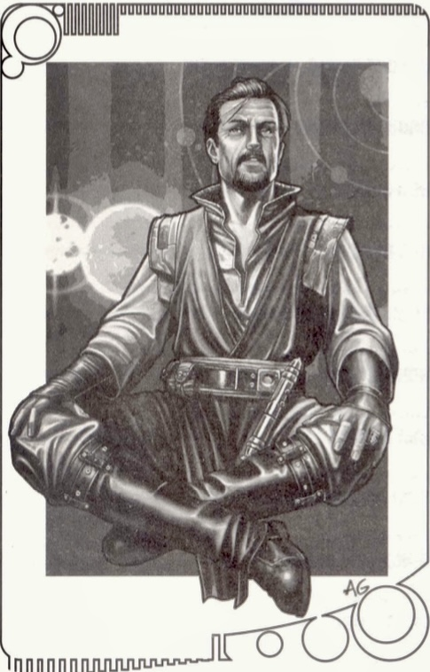
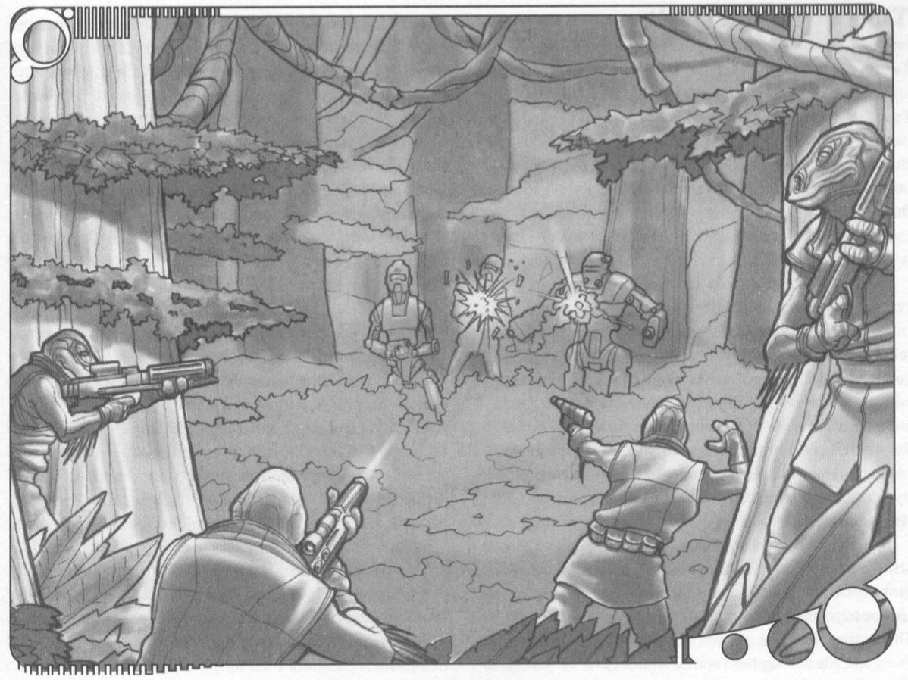

  

A long time ago in a galaxy far, far away...

"I sense a great disturbance in the Force. It comes for the Jedi academy on Almas. I stretch out with my mind into the Cularin system. but I cannot find the source of mv distress. It a haze, a mist that shifts and disperses when I come too close. Somewhere out there, a great evil is growing. Soon it will threaten my students, and possibly even this academy. If we are not prepared, it mav threaten much more.

"Cularin attracts a lot of interest from outsiders. Tibanna and irolunn gas. rare woods, ch'hala trees, and various crystals are all valuable commodities here. The Republic government. the Metatheran Trading Cartel, the so-called Smuggler Confederation. and manv honest (and dishonest) merchant‹ flock to the system like mvnocks to a ship's hull. In their wake come explorers, bounty hunters, ringers hoping to make their fortunes, gamblers, exiled politicians from othel systems-everything the galaxy has to offer. The svstem's main planet. Cularin, serves as a base for man of these interests. as well as a home to the svstem's native sentient species the Tarasin. Genarius, a planetary gas giant, harbors huge floating cities that mine gas, manufacture technology, offer gambling, and entice with other entertainment. The asteroid belt hides smugglers, pirates, rogue Jedi, and even a few honest beings who just want privacy. Even the moons hold life, supporting many commercial operations. Unfortunately, with 10 million beinas living on the systems three main planets and seven moons, evil finds plenty of places to hide.

"The Force is strong here. The ancient Sith knew this well. A half-buried fortress on the desert side of Almas stands as a mute testament to their interest in the system over a thousand years ago. The Tarasin have a natural abilitv with the force that I have only begun to understand. Une or the moons provides excellent crystals for lightsabers-the crvs tals have drawn Jedi here for decades. The natural strength of the Force is the reason my predecessor, Nerra Ziveri, came here to build a new Jedi academy, That, and the need to keep a watchful eye on the Sith fortress. The dark side is strong there, very strong. But I feel the dark side elsewhere in the sustem. too. Weaker. but still present. It is as if evil has been sleeping here for centuries, ever since the Sith left. Now somethina. or someone. is stirring it to consciousness. The future or this system is hard to see. Even Yoda cannot predict what is to come. I have tried and failed. sometimes investing more effort in worrying about the future than minding the living Force embodied in my students. Yet I must prepare them, and through them. al beinas who live here. The coming davs will be dark, and difficult to survive. We will need the Force to triumph."

-Jedi Master Laius Qel-Bertuk

Welcome to Cularin, a system in the Expansion Region of the galaxy. (ularin is located close to the lorellan Kun Trade Route and possesses a varietv of resources that attracts the interest or sentient beings from across the galaxv. Gravitic anomalies and aravitv shadows make hyperspace travel to Cularin expensive and time-consuming, giving the system a feeling of remoteness in the midsi of galactic activity. And, as Master Vel-bertuk has observed, there is evil present amidst the populace of this
burgeoning locale Cularin. the home system of the RPGA® Network's Living force campaign, Is a place where adventure thrives. In these pages, you'll find the planets of the Cularin system, systemwide power groups, and insights into the local Jedi academv. Characters abound here: villains. heroes, and the sentients in between who serve the highest bidder. Mysteries and unexplored places abound, all waiting for you. For information about the RPGA Network and the Living Force campaian. turn to Chaoter 6. There vou can read instructions for creating characters, find rules specific to the campain. and see some additional character options for kPOA members. You may find that these new options, and the Living Force adventures, enrich your home campaign as well. You are welcome to use them. Whether you play in the Livina campaian or use this material for vour home Star Wars campaign, the Cularin system offers myriad possibilities for adventure. Enjoy your exploration of this new addition to the Star wars universe, and may the force be with you.

## Cularin System Overview

Aeons pass.

A black hole collapses into itself and disappears, agitating a nearby nebula. The strain on the nebula alters its internal gravity. A star forms in its center. a bright beacon of hope in a muddled cosmic mass. The nebula slowly changes. A thou- sand millennia later, a second star forms, sibling to the first. The two begin orbitina one another.

Millennia pass.

The nebula spins into a plane and collapses, dispersing and coalescing into a system of five planets. A gas giant shows brief signs of becomina a third star, but falls short. settling it anary inst. mss a small system of its own that will later flourish within a bril-
liant gaseous atmosphere. A cloud of comets. born near the edge of the nebula, skirts the fringes or the system

A roque planetoid hurtling through space is pulled toward the system. It falls into an eccentric orbit around the two suns. It hides far from their light. but is unable to break away from their grasp. One of the svstem's planets is subiected to catastrophic stresses from within. It explodes, sending shock waves and debris through space. Most of the pieces settle into the former planet's orbit, forming an asteroid belt and dividing the svstem. A few rockv asteroids escape. Two crash into one of the gas giant's moons. The moon becomes highly volcanic and belches dust clouds over its surface. On the second planet. life evolves. Rain forests and jungles develop around mountains stretching to the clouds. Among the trees. a reptilian race achieves sentience and develons its own society. It lives peacefully, unaware of other worlds for thousands of years, happy to believe the stars above will forever remain bevond its grasp.

Centuries pass. ...

A man dressed in black steps off a transport. He builds a refuge for himself on the fourth planet, just outside the aster. old belt, where he can delve into the mysteries or the dark side. By creating a form of plant life. he converts the poisonous atmosphere of his chosen world into breathable gas. As it warms the surface of the planet. the world's ecologv subtle changes. The figure in black is eventually hunted and forced from the system during the Sith Wars, leaving behind his ecological creation and a grim fortress half buried in the around. The Jedi who fought him take no note or the system. pleased to have defeated the Sith. They log the system's mame Cularin. in a database and promptlv forget about it.

And time passes...

### Age of Discovery

An exolorer named Reid1 Artom emerges trom hyperspace at the edae of the comet cloud. warned ov her shin's sensors of anomalous gravity wells. Bringing her ship sharply about, she comes to a stop and scans the space ahead of her. "Comets. And nothing on my star charts, either. Could be interestina." She smiles a crooked smile. She lives for this sort of discovery. Flying a course around the comet field, she sees a star system anead or her. A jump Drin nr the svstem. She immediatelv begins survevina the planets from ornit one ov one "A rock. Seen one, seen em all. A planet, looks habitable. definitely a thick atmospnere. A gs gn. sure we check the composition there, see what kind or gases we're dealing with, make sure you can live in them. Probably dlentv of room in there. Some kind of outer planet. Doesnt look like it should have an atmosphere, but sensors show life. Even the moons look promising. In the middle of everything, and yet totally unknown. What a discovery! And it's all mine!

Landing on the second planet, she notes the jungles and the huge lizardlike creatures that approach her ship. Her transport. a strange silver thin from the skv. has them a little nervous, but she s quite thankrul-she might not even be half a mouthful for some of those thinas! She meets the Tarasin, a native species, and tells them of the galaxy outside their world, grand stories that are met with more than a touch or skepsm. samps or an gas from various planets and then departs. Reporting to the Republic Bureau of Exploration and Colonization, she names the system Reidi Artom VI. Reidi Artom I through V didn't prove particularly profitable, but she's got a good feeling about VI.

> **Cularin System Timeline**
>
> In the following table, years are expressed relative to the events of The Phantom Menace. On Cularin and Almas, years are measured relative to Reidi Artom's discovery of the system (A.A., or "After Artom"). If a character needs to refer to the year of an historical event, add 200 to the number listed on the left-hand side of this table. For instance, the current year in the campaign is 201 A.A.
>
> | Year | Event                                                                             |
> | ---- | --------------------------------------------------------------------------------- |
> | -200 | Reidi Artom "discovers" the system                                                |
> | -175 | Artom leaves for the Unknown Regions                                              |
> | -156 | Jedi Kibh Jeen turns to the dark side                                             |
> | -149 | Kibh Jeen defeated                                                                |
> | -145 | Kibh Jeen defeated                                                                |
> | -129 | Tarasin Revolt begins                                                             |
> | -122 | Jedi negotiate Cularin Compact and end Tarasin Revolt                             |
> | -87  | Nerra Ziveri assumes charge of the Jedi Academy                                   |
> | -84  | Trade Federation achieves control of trade in Cularin                             |
> | -78  | Riboga the Hutt establishes criminal organization                                 |
> | -24  | Nerra Ziveri disappears; Lanius Qel-Bertuk becomes Academy Headmaster             |
> | -21  | Nirama assumes control of criminal and smuggler organizations                     |
> | -1   | Metatheran Cartel formed; trade conflicts begin                                   |
> | 0    | Trade Federation driven from Cularin system; Neimoidians defeated at Naboo system |
> | 1    | Living Force campaign begins                                                      |

Weeks later, a records search reveals ancient notations made by the Jedi. The system's older name is assigned to the discovery. From that moment on, both the system and its second planet are known as Cularin. Reidi Artom returns to explore further, making herself a hero among the locals. She stays for nearly a quarter of a century. During that time, she charts much of the system and its features.

Months after Reidi's return, the first outsiders arrive, representing a tibanna gas mining company. The company establishes the first floating city in the clouds of Genarius, a planetary gas giant. More outsiders follow, and the harvesting of the system's resources begins. The Tarasin look on with curiosity, but fight back with surprising ferocity when a human company begins to tear the trees from their homeworld. Eventually the outsiders strike a treaty with the Tarasin, and further bloodshed is averted. A friendship develops, strained at first, but it grows as the Tarasin and the outsiders get to know one another and pursue their disparate agendas.

As more and more aliens arrive on Cularin, the Tarasin worry about the future of their home. Fearing further attacks, aliens build cities on huge platforms that rise above the forest canopy, preserving the natural resources and giving the aliens places to call home. In a matter of decades, only a few settlements remain on ground level. These include Gadren and Hedrett-the twin cities originally settled by Reidi Artom and her crew-and some of the oldest Tarasin cities. Spaceports develop on the floating platforms, inexorably linking Cularin to the galaxy at large.

> **Reidi Artom, Explorer**
>
> Reidi Artom, a Near-Human whose species lives for hundreds of years, discovered that she loved excitement, discovery, and the thrill of exploration. She never understood why her people remained on their own planet. So much of the galaxy remained open to them if they only wanted to take it. Sensing opportunity, she escaped from her homeworld at an early age and never looked back. For years, she wandered among the stars, taking life as it came and doing whatever it took to get from one place to another.
>
> Her big break came when a ship she had stowed aboard, a scout vessel, came under attack. The pilot was killed instantly, and the ship was left floating in space. Reidi was able to make repairs to the environmel hyperdrive and get to a starport. After she registered the ship again under her own name, the galaxy opened up before her.
>
> Realizing that the best way to see new worlds was to get paid for it, she became a scout for the Republic and surveyed new systems. While most scouts were sent into the Unknown Regions or the Outer Rim, she went into the Exploration Region to find planets others had missed. Her first discovery, Artom, still bears her name. Later discoveries followed local or ancient names, but she is credited with renewed interest in at least eight systems. Reidi was last seen about 175 years ago. At that time, she was headed for the Unknown Regions. Whether she is dead or alive remains to be seen, but the life span of her species is long enough that she may still be exploring.
>
> **Reidi Artom:** Female Near-Human Fringer 2/Scout 10; Init +2; Defense 21 (+9 cclass, +2 Dex); Spd 10 m; VP/WP 74/17; Atk +10/+5 rnaged (3d6, blaster pistol); SA Adaptive leraning (Sense Motive), barter, Skill Mastery (Computer Use, Hide, Search, Pilot), trailblazing, uncanny dodge, SV Fort +10, Ref +9, Will +7; SZ M; FP 3; Rep 3; Str 13, Dex 15, Con 14, Int 14, Wis 15, Cha 13.
>
> **Equipment:** Three blaster pistols, extraa power packs, clothing, environmental suit, flight suit, survival and exploratory gear, scout starship _Trailblazer_.
>
> **Skills:** Astrogate +15, Climb +7, Computer Usse +15, Hide +15, Knowledge (Cularin system) +12, Knowledge (spacer lore) +9, Listen +15, Pilot +19, Repair +17, Search +11, Sense Motive +5, Spot +10, Survival +15; Read/Write Basic, Speak Basic.
>
> **Feats:** Alertness, Gearhead, Point Blaank Shot, Shsarp-Eyed, Spacer, Starship Operation (space transport), Toughness, Weapon Group Profiencies (blaster pistols, blaster rifles, simple weapons).
>
> **Note:** These statistics describe Reidi at the time she left for Unknown Space.

### The Coming of the Jedi

Excitement builds around activity in Cularin as rich natural resources are exported. The Jedi return, probing the system with the Force. Sensing a powerful taint of the dark side surrounding the ancient Sith fortress, they send two Jedi consulars to explore.

One of the consulars, Kibh Jeen, is nearly ready to take his trials. His master, Qornah, has trained him well. He is certain that their current mission is a threat they can handle. Since the Jedi Council has reported that the ancient dark side site is dormant, Qornah pilots his shuttle down to the surface with confidence. Always ready to ignore the unpleasant side of existence, he does not feel the pull of evil. Behind him, his Padawan learner, Kibh Jeen, struggles silently. The shuttle lands. Two Jedi step onto the kaluthin- covered surface and walk toward the half-buried fortress. As Qornah probes with the Force, he does not hear the whispers that press against his apprentice's mind. Kibh Jeen succumbs to whispered temptations, cutting his master down from behind. Stepping over the body, he approaches the walls of the fortress and disappears.

Months later, Kibh Jeen returns. Strong in the dark side, he plans to sublugate the system and lash out at the Jedi Council. Piloting the shuttle into space, he searches for minions who would make useful tools. Pirates in the asterold belt suit his purposes admirably. In an almost thougntless display of power, he dominates their minds, and through them, attracts others to his service. An army grows. After hiss servants ssabotage a local power plaant, he unleasshes his anger at the floating cities of Genarius. Lightning arccs through the great clouds, destroying hundreds of homes aas his followers scream through the streets, blasters white-hot. Thousands die.

Kib Jeen's infamous assault launches the Dark Jedi Conflict, one of the bloodiest periods in the system's history. Over the next few yearas, the pirates prove reliably mindless tools. From their base in the asteroid belt, they strike and disappeara, hiding their ships in craters, crevasses, and the strange clusters of asteroids that spin together throughout the belt. The system's inhabitaants cannot find them, let alone eliminate them. Warships stop aall incoming transports. Innocents suffer. Kibh Jeen taakess delight in his enemeis' failure, but he also feels despair deep in his soul.

Finally, a Jedi Knight and her Padawan come to Cularin to end the crisis. They organize the system's inhabitants and trading compaanies. Directed by the Force, their armaada finds the pirates and, aafter a fierce space battle, crushes the pirate fleet. Kibh Jeen does not escape. He is cut down when the Jedi maneuver him into a vulnerable position. Perhaaps his own conscience, never truly destroyed by the dark side, plays some small part in his defeat.

After this regrettable incident, thee Jedi decide to maintain a permanent presence near the fortress to study it and wards off its evil. The Council begins a school for Jedi training on Almas, on the far side from the fortress. The school prospers, and the continual reminder of evil nearby keeps students dedicated to their studies. The story of Kibh Jeen is told to each new generation of Jedi, in rememberance of what can happen when one is too sure of one's beliefs.

Years pass, aand a Twi'lek Jedi Master named Nerra Ziveri aasssumes the position of Academy Heaadmasster. Ziveri, already powerful in the Force, turns his attention to probing the dark side aura in earnest. During these yearas, he trains a promising student named Laniuss Qel-Bertuk to take his place. Visions of the future reveal what he must do. Finally, he penetrates the aura of the site and feels the depth of the Sith influence. He calls Lanius aand tellss him to take ccharage of the academy. Without explanatio, Ziveri disappear from known space and the senses of the Jedi. What happened to him remains a mystery, but Lanius proudly continues Ziveri's tradition of teaching the living Force.

### The Tarasin Revolt

Life on Cularin itself is never ccompletely harmonious. The Tarasin live in their jungles, the aliens remain in their cities and the various cultures do what they can to get along. The Tarasin, sensitive to the Force, believe they should live in haarmony with the land, as they hvae alwaays done, rather than exploiting its bounty as the newcomers do. They try to help the aliens understand. To some extent, they succeed. But even in the Republic, native species sometimes suffer at the expense of progress or the desitres of the wealthy. Cularin is no exception.

The first signs of hostility come when the Tarasin bar certain companies from entering the jungle to harvest rare trees. They then declare the ch'hala trees sacred to their
religion. Words escalate into violence. Soon the trading companies decide they have to send armed troops down with their workers and droids to avoid losing valuable equipment. Tarasin reprisals are swift and deadly. The Tarasin tribes demonstrate that they've learned to use the technology of their alien opponents, and their natural ability with the Force makes them difficult to stop. The Jedi refuse to intervene.

The Trade Federation, holding major interests on Cularin, sends a force of war droids to secure their operations and protect their crews. The droids interpret their instructions far too loosely, and a number of Tarasin die in a brutal raid. This outrage provokes a series of violent counterattacks. Word spreads among the Tarasin, who prepare to remove all aliens from their world.

With the sanctity of the system at stake, two Jedi consular come from the academy to negotiate peace. Months of careful discussion follow, but the Tarasin refuse
to give in to outsider demands. Meanwhile, minor skirmishes result in the destruction of property and lives. After six months of negotiations, diplomats establish an accord called the Cularin Compact. In this agreement, they articu- late the rights of the Tarasin and sharply curtail the outsiders' ability to harm the planet. Peace comes slowly after that, but the Tarasin and aliens work together to harvest the resources of the planet while protecting its delicate ecological balance.

### Rise in Crime

Where legitimate trade flourishes, illicit trade follows. As Cularin's prosperity grows, incidents of piracy become more frequent. Shipments disappear, and smugglers bring in illegal goods. For some time the criminals act independently, but crime attracts the interest of an exiled Hutt named Riboga. Bringing the famed Hutt talent for organization with him, he gathers the criminals into a small syndicate. The pirates form their own gang. Conflict between the two groups escalates as the years pass.

The costs of running operations in Cularin also rise year by year. Unstable gravity wells make space travel to the system expensive. The costs associated with losses to the pirates make Riboga rethink his desire to do business there. As a result, he is not at all angry to lose the whole operation to his assistant, a strange alien named Nirama, in a sabacc game. When the last hand is revealed, Riboga laughs a throaty Hutt laugh and returns to Nal Hutta without looking back. What Riboga does not know is that Nirama has been skimming profits, faking accounts to make his operations look unprofitable. Through this strategy, he gains control of the criminal empire without incurring the Hutt's wrath or having to kill him, an act that surely would have brought its own hideous consequences.

### Trade Wars

The Cularin Compact brings protection to the planet and the Tarasin, but the Trade Federation sees it as an opportunity. Any contract has loopholes, and they are determined to exploit this one as they do every other. By manipulating terms, using dirty tricks, and employing a little outright sabotage, the Trade Federation drives its competitors out of the system. It seizes control of all legal trade in Cularin and holds it. The smugglers and Riboga the Hutt maintain control of illegal trade.

Decades later, trouble rears its head again in the Trade Federation. The Neimoidians, the leaders of the Trade Federation, make a deal to blockade a small planet in another system. Fearing the consequences of failure, two of the other races, the Filordi and the Caarites, break with the Neimoidians and form their own trade organization, the Metatheran Cartel.

While the Neimoidians pay attention to a powerful new client, the Filordi and Caarites scheme on a different front. They deduce that the Trade Federation can be dislodged from Cularin, and they are correct. The Metatheran Cartel begins by exposing the policies the Trade Federation has used to drive out competition and keep labor costs low. They begin direct competition with the Federation in its major market areas and invite other races, including the Sullustans, to start operations within the system.

But the Trade Federation is not completely ignorant of the Cularin situation. The Neimoidians realize they need income and resources from the system if they are to recover any kind of position as a trade leader. Lacking the resources to make direct confrontations, they hire pirates from the asteroid belt to harass Metatheran shipping and facilities. These attacks grow more desperate as the Neimoidians suffer heavily in another part of the galaxy: the Naboo system.

The conflict between the two trading groups would last for months, or even years, if not for two circumstances. First, some of the species allied with the Metatheran Cartel express their displeasure with the strategies both sides are using, complaining of dropping business and rising prices. The Cartel also notices the costs of the conflict and decides to attempt to buy out the pirates. At first unwilling to listen, the pirates begin considering the counteroffer. The Neimoidians have not paid them for their work, after all,
and the Cartel has credits to spend in the system.
Furthermore, the Cartel has made significant progress in
ousting the Trade Federation from its primary markets in
the system.

The decision becomes critical when a group of Naboo
natives defeats the Neimoidians. Word spreads that the
Neimoidians might lose their trade charter. Such a loss would
mean that the pirates would not get paid-so they immedi-
atelv switch sides. The Trade Federation's activities in the
system collapse, and it withdraws.

The Cartel, in light of this victory, lessens its own trade
activities, trying to gauge the demand of Cularin's inhabi-
tants and establish better business practices. It also takes a
few tips from the Trade Federation and begins using some of
the very practices it decried during the trade struggle.

### Cularin Today

It is a year since the defeat of the Trade Federation at
Naboo. The Metatheran Cartel has tightened its grip on
trade and turned on the pirates it allied with in trade
conflicts. Patrol craft are hunting pirate vessels in the aster-
oid belts, but failing to stop piracy. Smugglers thrive under
the new restrictions that the Cartel has put on trade.
Independent companies, invited into the system by the
Cartel, have refused to be dislodged. The SoroSuub
Corporation has built a floating manufacturing city in the
clouds of Genarius, supplying speeders and starships.
Gambling havens thrive deeper in the clouds of Genarius, as
do other unsavory elements.

Investors have completed terraforming of Almas's moon,
Dorumaa. They've opened a resort center that draws wealthy
quests from insystem and beyond. Nirama continues to run a
profitable criminal empire, despite problems with pirates.
Tarasin continue their simple lifestvle and ensure that aliens
are abiding by the Cularin Compact. Many Padawan learners
in the Almas Academy have become Jedi Knights and taken
students of their own. Others have stayed at the school to
teach, or left the system to follow the will of the Force. The
academy continues its vigil over the ancient fortress, and
notes with concern the slowly spreading deadness on the far
side of Almas.

Cularin has become a member of the Republic. A senator
elected on Cularin has taken her place in the Senate on
Coruscant. Official recognition has attracted official interest,
and Republic military vessels have arrived in the system.
Under the command of Colonel Jir Tramsig, the Republic has
established a military base on Cularin and a second base on
Dorumaa. Unknown to the inhabitants of the system, there is
a third secret base on one of Genarius's moons, Ostfrei.
Rumors circulate that another Dark Jedi has come to
Cularin, but no one can produce proof of his or her exis-
tence. The rumors do not lie, however. Master Lanius Qel-
Bertuk has begun searching the system for this new threat
that only he can feel.

[2: Cularin System Catalog >>](/campaign-guide/2-cularin-system-catalog)
