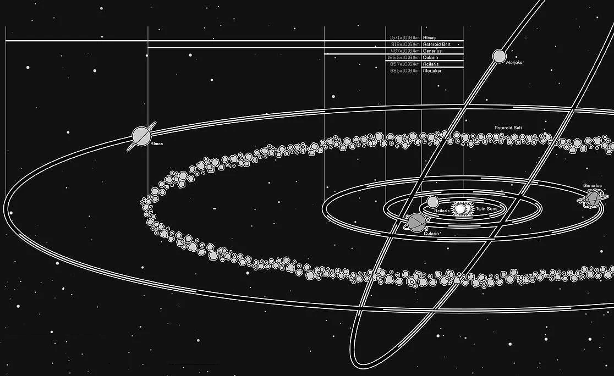
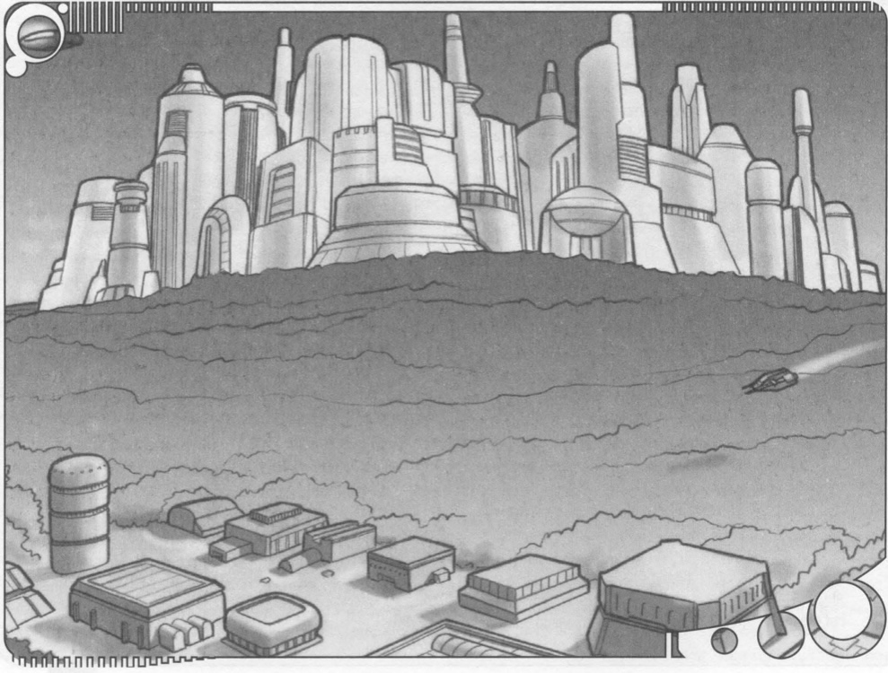
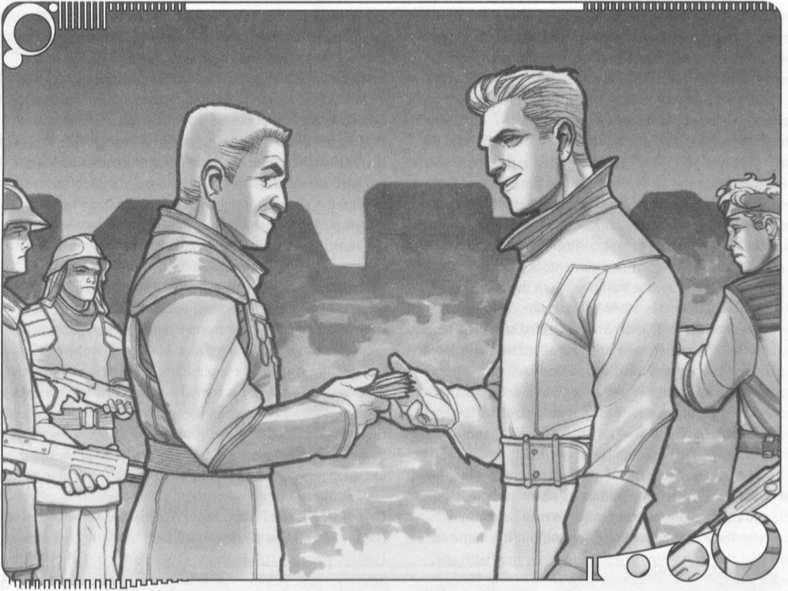
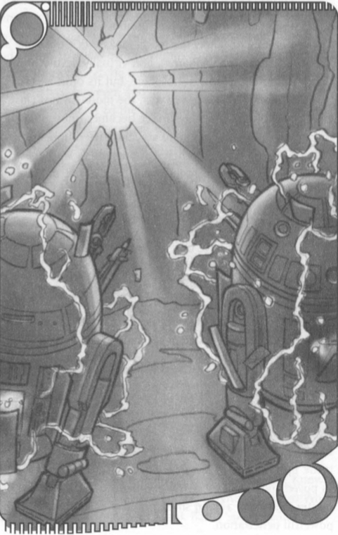

Though the Cularian system has easy access to the Corellian
Spine Trade Route, one of the main trade routes in the
known galaxy, it has only recently attracted attention from
the galaxy at large. The reason for this apparent isolation lies
in the strange gravitic anomalies found there. First, the cores
of three of the planets are extremely dense, resulting in
larger hyperspace gravity reflections than the bodies would
normally generate. The larger gravity wells overlap periodi-
cally in hyperspace, making the disturbance even worse.
Jumps into the Cularin system under these conditions are
extremely difficult for normal nav computer programs, but
they can be done.

Gravity reflections within the system are not the only
problem. The whole system is surrounded by a dense cloud
of comets, remnants from the system's formation. Most have
dense cores similar to the heavier planets in the system, and
as they pursue their erratic courses, they interact with each
other. Occasionally they collide, showering frozen debris and
creating smaller comets that take their place in the strange
cosmic dance.

Because of these two dangers, the safest way to travel to
the system is to arrive at a point just outside the comet cloud,
read the current behavior of the comets, and then make the
calculations for a second jump into the system itself. Larger
ships arrive at the outside edge of the asteroid belt and
proceed with sublight engines to their final destinations.
Some daring pilots attempt to approach the system from
above its plane, but this route is only a little more successful
than the traditional approach. The comets still pose a problem.
Because of their constant deflections off each other, the comet
cloud extends in a nearly spherical pattern around the system.
Thus, even when using a course that bypasses the asteroid belt,
pilots must stop to analyze the comet distribution before deal-
ing with the larger hyperspace gravity shadows.

After arriving, a visitor is first drawn to the two suns in
mutual orbit. Morasil was the first star to form. The ancient
yellow sun is perhaps as old as the galaxy itself, and it has
shrunk in its long lifetime. Alone, it produces a cold, dim
light that cannot reach the asteroid belt. Its partner,
Termadus, is a white dwarf star. Much younger than Morasil,
it has nonetheless sped through its solar lifetime. Now it
draws gases from the corona of Morasil, creating a gaseous
haze between the two stars. Together, they give the lumi-
nous equivalent of a single bright star, creating a gravita-
tional hyperspace shadow much larger than the realspace
area taken by their orbits.

## Acilaris

<aside class="float-right box">
  
<strong>Acilaris at a Glance</strong>

  <ul class="plain">
    <li><strong>Type:</strong> Barren Rock</li>
    <li><strong>Climate:</strong> None</li>
    <li><strong>Length of Day:</strong> 9 standard hours</li>
    <li><strong>Length of Year:</strong> 112 standard days</li>
  </ul>
</aside>

The closest planet to the twin suns, Acilaris could be
mistaken for a large asteroid, but definitely warrants
planetary status. Acilaris has enough gravity to hold
an atmosphere composed of light gases. Survival gear
is definitely required.

Because of its proximity to the suns, Acilaris has a very hot
surface temperature. The surface is far too hot for ships to
land safely. Thus, no one has been able to visit it. Sensor scans
of its emissions show a variety of rare minerals and even some
crystals. The presence of these minerals in other planets of the
system has kept the various mining consortiums from
attempting expeditions to Acilaris. However, unconfirmed
reports say that at least one company has contracted with the
droids of Uffel to produce special machinery that could with-
stand the conditions and begin mining.

<aside class="float-left box">
  
<strong>Cularin at a Glance</strong>

  <ul class="plain">
    <li><strong>Type:</strong> Barren Rock</li>
    <li><strong>Climate:</strong> None</li>
    <li><strong>Length of Day:</strong> 9 standard hours</li>
    <li><strong>Length of Year:</strong> 112 standard days</li>
  </ul>
</aside>

## Cularin

Cularin, the system's namesake planet. is covered in lush rain
forests and jungles. Mountain ranges reach through the trees
and almost touch the skies, forming plains and deep valleys
between them. Thick trees cover the whole planet, except in
a few places where logging companies have been active in
years past. The climate is mild and humid, reaching uncom-
fortably high temperatures during the height of summer. At
night, the inhabitants enjoy cool temperatures. Rain falls
almost every day, though not strongly enough to disrupt
activities or threaten lives.

Among the planet's many trees are a number of rare hard-
woods and the mysterious ch'hala trees. Ch'hala trees are tall
with thick drooping foliage. Their greenish-purple bark
produces swirling color patterns across the planet's surface.
The Tarasin natives claim the trees are not native to the
world. Some of the softer woods are highly prized. attracting
great interest from various corporations.

Cularin is a world rich in lifeforms. Great lizards called
kilassin occupy the top of the food chain. Of the many vari-
eties of kilassin that live deep in the ingles, most are
omnivorous. but some prefer live prev to plants. As settle-
ments continue to appear, the lumbering beasts are driven
farther from civilization. A few have been captured and
domesticated. Corporations such as the Metatheran Cartel
use them as labor beasts when they cannot take repul-
sorsleds into the iunales.

Much farther down the food chain, small creatures called
mulissiki scavenge for food. Commonly seen around Tarasin
settlements, these scavengers keep villages clean by devour-
ing waste just about as fast as it is produced. Because they
scurry away from any approaching creature, they do not
) really pose a problem to the Tarasin. In the cities, however.
mulissiki are a nuisance. Once they get into the platform
cities, they cannot escape. Instead, they make nests in what-
ever dark corners they can find.

The mountain ranges that cut through Cularin's jungles
reach beyond the clouds. The lower ridges support Tarasin
villages and other life, but the higher reaches are devoid of
all creatures except mulissiki. One range, the Kiallquis, has a
sheer face that is particularly suited to speeder racing and
mountain climbing. In the past, the Tarasin used it to test
the truth claims of suspected criminals (by lowering them
over the edge), but in modern times, the ridge is used more
for sponsored speeder races.

### Natives

The intelligent natives of Cularin are called Tarasin. These
sentients are remotely related to the great kilassin. Both
evolved from the same ancestors, but along different paths.
Tarasin developed a tribal society, while the kilassin contin-
ed to migrate in herds. Tarasin tribes, called irstats, usually
contain between thirty and fifty members. Larger tribes also
exist. For instance, the Hiironi irstat contains more than
three hundred members. However, most Tarasin prefer
smaller tribes and simpler lives.

The Tarasin believe they maintain a symbiotic relationship
with their world, a belief that motivates their religion.
Through an attunement to the natural world, Tarasin can
sense the Force naturally. Traditionally, their religious figures
have become Force adepts, but their race did not fully
understand the Force until Jedi came to the system. Their
religion is based around a simple appreciation for nature.
They sense life around them through their quills and value it
too much to break the circle of symbiosis. Because of this
spiritual closeness, Tarasin do not travel very far from Cularin
for extended periods. In fact, they are fiercely protective of
their world and its resources, violently protecting it from
outsiders. This attitude has forced them into conflict with
offworlders twice in their history.

Originally, Tarasin were too quick to trust offworlders.
Visitors found the exotic woods of the forests impressive,
and the Tarasin sensed their interest. As a friendly gesture,
they began harvesting these commodities immediately.
Tarasin methods were slow compared to the demand of the
galaxy at large. When offworlders began tearing down the
forests themselves, conflicts resulted. Since then, the Tarasin
have learned to compromise. The best example of this is the
Cularin Compact, an agreement protecting the kilassin, the
minerals of the planet, and most importantly, the forests. In
Tarasin religion, the most unique trees on the planet, the
ch'hala, are sacred. As part of their compromise, Tarasin now
allow offworlders to claim a few of these trees each year.
Each must be transplanted and taken offworld alive.

<aside class="box">

### Native Species of Cularin

#### Tarasin

The Tarasin are a tribal species of reptil-
in humanoids with a rich oral tradition.
Most tribes are small (only a few dozen
Tarasin each) and led by a chieftain, usually
the second oldest female in the tribe. They
refer to the eldest female in the tribe
simply as "Mother," holding her up as a
model of perfection.

**Personality:** Calm, communal, curious, fiercely protective of their world and
its resources. Tarasin rarely get violently
angry unless their world or their tribes
are threatened.

**Physical Description:** Reptilian humanoids. The average Tarasin stands about
1.6 to 1.7 meters tall. Its body is covered in
translucent scales. The skin beneath the
scales changes color. When one is frightened
or angry, a multicolored "fan" of thin, scaly
flesh spreads out around a Tarasin's head.

**Tarasin Homeworld:** Most of Cularin is
a tropical rain forest.

**Language:** Tarasin speak their own
language, Tarasinese. Their hunters also use
a silent form of communication that relies
on their color-changing skin.

**Names:** Dariana, Sa'Alana,. Ta'Sen.

**Adventurers:** Most Tarasin adventurers
are curious about offworlders and new tradi-
tions. Fringers and scouts are very common.
A growing number of Tarasin take up the
traditions of the Jedi. Force-users prefer the
Force adept class and often serve as religious leaders.

**Tarasin Species Traits**

- +2 Intelligence, -2 Strength.
- Medium-size.
- Tarasin base speed is 10 meters.
- +4 species bonus to Fortitude saves
  against heat hazards.
- +4 species bonus to Hide checks
- +2 species bonus to See Force checks (only Tarasin Force-users with the requisite feats gain this bonus).
- Silent Communication. The Tarasin's color-changing scales allow it to communicate silently with any other Tarasin within 10 meters. Members of other species who learn to interpret this language (by spending the requisite skill points) may understand it, but can never "speak" it.
- -2 penalty to Bluff and Sense Motive
  checks. The Tarasin's color-changing
  scales, as well as the multicolored fan,
  make hiding emotions difficult.
  Because of this, they also have diffi-
  culty detecting deceit.

#### Kilassin

Kilassin, though native to Cularin, resemble
great lizards and dinosaurs from other plan-
ets in the galaxy. Kilassin come in many
colors, ranging from the subtle to the glar-
ingly obvious. Color does not seem to hinder
their hunting ability. Some offworlders have
reported seeing the same kilassin as one
color one day and a different color the next.
Tarasin reply that the offworlder must have
seen two similar kilassin.

Kilassin come in two main body types
with individual variations. Some are long and
thin with long legs; they rise up to survey
their domains as towering, bipedal stalkers.
Others are more compact and dense, sham-
bling through the jungle as gargantuan,
lumbering behemoths. All kilassin can walk
on four legs, though most can walk on hind
legs for brief periods and attack with their
forelegs. Kilassin claws are thick and long,
capable of digging into dead tree trunks for
worms or ripping the throats from smaller
creatures. Most have mouths full of teeth, but
the teeth are adapted to varying foods and
designed more for grinding than tearing.

Kilassin do not handle heat well. During
the hottest parts of the year, they retreat to
large lakes or deep forested valleys, where
they survive by eating fleshy plants and
(occasionally) each other. During the cool
parts of the year, they roam the planet in a
nomadic fashion, staying in place only long
enough to breed young, grab a meal, or
sleep. Kilassin sometimes bring down prey
that's too large to eat in one sitting. When
this happens, they leave the half-eaten
carcass behind for other kilassin to find.

Kilassin attack with their claws, not their
jaws. They bring down prey and rip it apart
with their claws before eating. Claws take
the place of sharp flesh-ripping teeth, so that
they can also chew and digest plant matter.
Kilassin do not generally attack creatures
except when hungry. They flee from need-
less conflict, and modern weapons scare
them off immediately.

**Hilassin:** Herd Animal or Predator 5; Init
+0; Defense 14 (-2 size, +6 natural); Spd
20 m; VP/WP 52/36; Atk +8/+8 melee
(1d6+7, claws); SQ Low-light vision, +4
species bonus on Swim checks; SV Fort +8,
Ref +3, Will +1; SZ H; Rep 0; Str 22, Dex 10,
Con 18, Int 2, Wis 10, Cha 9.
Skills: Listen +4, Spot +4, Survival +2.
Feats: Cleave, Power Attack, Track.

#### Mulissiki

A mulissik is a meter-long, four-legged crea-
ture with smooth skin, a long, thin tail, and a
long nose. Its skin is primarily brown with
irregular streaks of green and white. A
mulissik can bend its prehensile nose to
search in trees and mounds for refuse. It
usually lives off the waste of other creatures.
Although it's not very particular about what
kind of waste it devours, it is also a finicky
creature that likes to keep clean. After root-
ing through a mound of smelly refuse, it
makes for the nearest waterhole or river to
clean itself off. It really enjoys the bathing
process, almost as much as it enjoys getting
dirty. Whiskerlike antennae on its face help it
sense its surroundings. Mulissiki are com-
pletely deaf, relying on their whiskers to feel
pressure changes in the air.

Mulissiki congregate around sources of
refuse, but can be found almost everywhere
on Cularin, even on the highest mountain
ranges. The creatures thrive even when
there is no apparent food. They can be quite
tasty themselves, but must be cooked thor-
oughly for Human or Tarasin consumption.
The huge kilassin only hunt mulissiki that
are clean or in the process of cleaning.

Mulissiki do not attack large creatures.
They can, but they don't; instead, they cower
and hide. When really threatened, they emit
a stinky cloud of gas that requires anyone
within 20 meters of the creature to make a
Will save (DC 12) or flee.

**Mulissik:** Scavenger 1; Init +4; Defense
17 (+1 size, +4 Dex, +2 natural); Spd 25 m;
VP/WP 6/14; Atk +4 melee (1d4-2, bite); SQ
Low-light vision, stink gas cloud (Will save
DC 12); SV Fort +3, Ref +6, Will +0; SZ S; Rep
0; Str 7, Dex 19, Con 14, Int 3, Wis 10, Cha 7.
Skills: Hide +6, Spot +4, Survival +2.
Feats: Weapon Finesse (bite).

</aside>

Tarasin are omnivorous, but usually prefer plants native to
Cularin. Their species used to avoid eating meat, but as they
moved closer to Human cities, they adjusted their diet.
Tarasin still do not eat animals except in the company of
offworlders. Although they hunt kilassin for their skins,
bones, and organs (which are medicinal, according to the
tribal elders), they find the idea of hunting them for food
very distasteful.

Tarasin villages contain small buildings; each one shelters
one or two sentients. Residences were once made of wood
and plants, but are now built from modules of prefab mate-
rials imported from offworld. Structures are often integrated
with the surrounding tree branches. The buildings, even
prefab ones, fit so well into the surrounding trees that it is
sometimes possible to walk right through a Tarasin village
without realizing it.

Most villages look extremely temporary. Many first-time
visitors think an entire village could easily be packed up and
moved the next day. This is not true. Tarasin irstats very
rarely live a nomadic lifestyle. The villages contain common
buildings for craft and industry, living spaces, and storage
buildings. After their oldest settlements were devastated by
Trade Federation war droids, Tarasin have learned to use
modern tools and weapons. In a local village, it is as
common to see stored blaster power packs as it is to see
kilassin skins or food.

Tarasin tribes elect the second eldest female as chief. She
assumes the title of Irstat-Kes, which means "tribal leader."
Their society is not matriarchal in the sense that females
dominate. In Tarasin culture, females remain in the villages
while male Tarasin hunt for resources. Thus, it makes sense
that someone who is at the village should be the leader. The
oldest female of each irstat becomes a wise woman whom
the Tarasin call "Mother." Tarasin Mothers embody the best
aspects of the Tarasin way of life, and all look up to them.
Tarasin Irstat-Kes and Mothers are often Force adepts as
well, although this is not required.

The largest tribe, the Hiironi, has settled near the only
offworld towns on the surface of the planet. Reidi Artom
opened her negotiations with the Irstat-Kes of the Hironi,
not realizing that one tribe is no more important than
another among the Tarasin. The Hironi irstat was smaller
hundreds of years ago. Twelve tribes lived near Cloud
Mountain, the highest peak on the planet. Tarasin used to
say that the top of the peak was made of clouds, not rock-
hence the name. Cloud Mountain proved them wrong when
it erupted, causing an earthquake in the mountain range.
Rock and lava rained down on the jungle for days. When the
rocks stopped falling, the tribes came out of hiding and
joined together for mutual aid (in the Tarasin language,
"Hiironi" means "different but together"). The irstat stayed
together and moved farther from the mountain. Now the
mountain serves as a focal point for many other tribes,
largely because of its size.

#### Dariana, Mother of the Hiironi

The most ancient and wise of all the Tarasin, Dariana is no
longer the paragon everyone believes her to be. She is indeed
wise, but she is also selfish, working for her own good as
much as the good of all Tarasin or the Hiironi itstat. Dariana
was never Irstat-Kes. Her sister Meirana was slightly older
than she was and more capable; thus, Meirana assumed
leadership. Dariana was at first content, but later wanted
more of a role in the tribe's affairs. When the previous
Mother was accidentally killed by a kilassin, Meiriana was
chosen as Mother and Dariana was selected to be the new
Irstat-Kes. This arrangement was just what Dariana wanted,
but within a day, a strange disease killed Meirana. Other
Force adepts said that she was called to be one with the
world. Darian found herself as Mother instead of the lead-
ership role she wanted. She truly tries to fulfill her role, but
she chafes when her wisdom is not heeded.

Wizened yet still tall, Darian wears the traditional robe of
the Mother well. She carries a blaster pistol because, as she
told the children one evening, wisdom may be the most
powerful force in the life of the Tarasin, but it is not more
powerful than a running kilassin. Her eyes, gray with age,
look upon the world with a little disillusionment. Her skin no
longer changes colors, and she rarely leaves the village of the
Hiironi, but she still manages to be present at any important
talks between Tarasin and offworlders. She is nearing the
end of her life. The closer she comes to death, the more
involved she wants to be in life.

> **Dariana:** Female Tarasin Force Adept 16; Init -1; Defense
> 18 (-1 Dex, +9 class); Spd 10 m; VP/WP 52/11; Atk
> +11/+6/+1 melee (1d6, quarterstaff; see below); +11/+6/+1
> ranged (3d6, blaster pistol); SA Comprehend speech, Force
> talisman, and Force Ouarterstaff (see below); SQ +4 species
> bonus to Survival checks in heat conditions. -2 species
> penalty to Bluff and Sense Motive checks: SV Fort +9, Ref
> +6, Will +13; SZ M; FP 7; Rep 18; DSP 2; Str 9, Dex 9, Con
> 11, Int 16, Wis 17, Cha 10.
>
> **Equipment:** Force Quarterstaff (use 3 vitality to get +2d4
> damage bonus for 16 rounds); Force Talisman (+4 Force
> bonus to saving throws against Force skills and Force feats).
>
> **Skills:** Craft (cooking) +13, Craft (weaponsmithing) +11,
> Handle Animal +4, Hide +5, Knowledge (Cularin-flora and
> fauna) +19, Listen +15, Sense Motive +13, Spot +13,
> Survival +15, Swim +9, Treat Injury +11: Speak Basic, Speak
> Tarasinese, Understand silent Tarasin color language.
>
> **Force Skills:** Affect Mind +6, Empathy +17, Enhance
> Senses +11, Farseeing +12, Force Grip +9, Move Object +7,
> See Force +19.
>
> **Feats:** Dodge, Fame, Great Fortitude, Quickness,
> Trustworthy, Weapon Group Proficiencies (blaster pistols,
> primitive weapons, simple weapons).
>
> **Force Feats:** Alter, Control, Dissipate Energy, Force-
> Sensitive, Sense.

#### Cryalira, Irstat-kes of the Hironi

Cryalira is surprised to find herself as Irstat-Kes. She expected
that she might gain the title someday in the distant future,
but Meirana's sudden death immediately thrust her into the
spotlight. A skilled hunter, Cryalira would rather be roaming
the jungle than presiding over the Hiironi or interacting with
the Humans in Gadrin. She believes that she is not trained
for her current position, and that she does not have the
natural talent to succeed. Her reluctance shows in her deci-
sions, or lack of decisions, frequently.

For a Tarasin, she is pretty. Her scales are very neat, her
eyes are a clear blue, and her skin fan is very attractive. She
tends to use it when she is presiding, confusing everyone by
making them think she is angry. Thus, by accident, she over-
comes her own nervousness. She is growing into her position.
Given a little more time, she could be an excellent Irstat-Kes.
Whether she will have the time, only the Force knows, as one
or two malcontents in her tribe plot against her leadership.

> **Cryalira:** Female Tarasin Scout 12; Init +2; Defense 20 (+8
> class, +2 Dex); Spd 10 m; VP/P 84/15; At + 12/+7 melee
> (1d8+3, spear), +11/+6 ranged (3d6, blaster pistol); SA Skill
> Mastery (Hide, Search, Listen, Survival), trailblazing, uncanny
> dodge: SQ +4 species bonus to Survival checks in heat
> conditions, -2 species penalty to Bluff and Sense Motive
> checks: SV Fort +8, Ref +8, Will +7; SZ M; FP 6; Rep 11; Str
> 16, Dex 14, Con 15, Int 15, Wis 13, Cha 14.
>
> **Skills:** Climb +12, Diplomacy +6, Hide +17, Listen +15,
> Knowledge (Cularin-flora and fauna) +14, Move Silently
> +12, Search +10, Spot +15, Survival +19, Swim +7, Treat
> Injury +7; Speak Tarasinese, Understand Tarasin silent
> color language.
>
> **Force Skills:** See Force +6.
>
> **Feats:** Alertness, Dodge, Mobility, Skill Emphasis (Survival),
> Track, Weapon Group Proficiencies (blaster pistols, blaster
> rifles, simple weapons).
>
> **Force Feats:** Force-Sensitive, Sense.

#### Pisonna

Fissona is a nine-year-old Tarasin child. He's a troublemaker
in the Hironi irstat. His parents don't manage him well, and
his natural liveliness often gets him into trouble. He is the
grandson of Cryalira, the Irstat-Kes, but his position doesn't
prevent him from being caught and punished. When
encountered, he is either running from trouble or sitting
with his young friends thinking up a grand scheme against
Humans in the nearby towns. His redeeming virtue is that he
knows everything that happens in the Hiironi village.
Unfortunately, this is because he listens at doors and spies
on his tribemates.

As young Tarasin go, he looks average, but he has devel-
oped good control with his color-changing ability. He wears
medallions he carves from rocks and branches. They do not
show any talent on his part, but he likes his own work and
has a higher opinion of himself than is warranted.

> **Pissona:** Male Tarasin Fringer 1; Init +2; Defense 15 (+3
> class, +2 Dex); Spd 10 m; VP/WP 8/11; Atk +0 melee, +0
> ranged; SQ +4 species bonus to Survival checks in heat
> conditions, -2 species penalty to Bluff and Sense Motive
> checks; SV Fort +2, Ref +3, Will +2; SZ M; FP 0; Rep 0; Str
> 12, Dex 15, Con 11, Int 13, Wis 15, Cha 12.
>
> **Skills:** Climb +2, Hide +6, Listen +3, Spot +4, Survival +3;
> Speak Tarasinese, Understand Tarasin silent color language.
>
> **Feats:** Alertness, Quickness, Weapon Group Proficiencies
> (blaster pistols, simple weapons).

#### Gadrin and Hedrett

When Reidi Artom first landed on Cularin, she set her ship
down in a clearing next to the Estauril, a river almost two
kilometers wide. There she met the Hiironi irstat. When she
returned, she helped build the original buildings of the first
town, Gadrin, where the river flowed into the base of
Cloud Mountain. The population expanded quickly, and a
second town called Hedrett was started on the other side of
the river. Reid linked the two towns with a great bridge.
Soon they became cities and expanded into the jungle. The
Tarasin, seeing unchecked expansion of the cities as bad for
their world, opposed any new building. After the Tarasin
Revolt, Humans and aliens erected the first platform cities.
As more offworlders moved there, Gadrin and Hedrett
dwindled into backwater towns.

Gadrin was originally planned on a grid, but rapid expan-
sion during the town's early years caused the leaders to
abandon that plan, letting people build wherever they
wanted. The buildings are made mostly of wood from the
surrounding jungle, but after prefab buildings were brought
in, the city became a mixture of wood, metal, and plastic
structures. Hedrett held to the grid system much better, and
builders in Hedrett used mostly prefab metal construction.
Gadrin looks more native and older than its sister town.

In size and population, the two towns are very similar.
Gadrin boasts a population of 18,000 offworlders and 2,000
Tarasin. Hedrett rates its population at 16,700 offworlders
and 2,900 Tarasin. The similarities end there. The towns have
developed as if each was trying to be different from the
other, as though the river somehow made the town on the
other side a rival or enemy.

A governor rules Gadrin. In theory, the people can elect a
new governor every four years. In practice, real elections have
not been held in over thirty standard years, and no one really
minds. Democracy, the people have found, can be a lot of
work. The residents would rather spend their effort on
commerce instead. Reidi Artom dreamed that the leaders
would serve one term each and then return to private busi-
ness, so that the duty of government would fall on everyone.
Again, practice differs greatly from this ideal. Within the last
thirty years, "professional" politicians have changed the elec-
toral system to the extent that the governor appoints other
needed officers, and the people ratify his choices with a
public vote. No campaigning accompanies these votes. Many
of the citizens don't know when elections are held, and they
simply don't care. This ignorance results more from apathy
than any real attempt to conceal the vote from the citizens.
Voting in Gadrin is a formality. If the governor had to
choose from a longer list of candidates, he would probably
be unable to decide.

Hedrett, on the other hand, governs itself through a Town
Council composed of nine senior counselors and twelve
junior counselors. Each junior counselor's vote on any matter
counts as half that of a senior counselor, so the total
number of votes on any issue can be as high as fifteen.
Unlike Gadrin, the people on this side of the Estauril partici-
pate in their government. They enjoy elections, or at least
find them entertaining. Votes on major issues not only
attract all the counselors, but a number of citizens who
don't have any pressing business at the time. The citizens
harangue the counselors and argue with them as if they
could also vote, thus prolonging debates. No one can say
that the public is not involved in every decision.

Election of counselors follows a similar practice. Elections for
empty seats are held with a week's notice. Interested candidates
can campaign all they want after they've filed a petition to run
for office and made a lengthy speech to the Town Council.
Unfortunately for the residents of Hedrett, no major issues of
interest have surfaced in two years, not since Senior Counselor
Westa Impeveri upset popular favorite Karid Blakken. Blakken
had the votes recounted, because he suspected Impeveri of
rigging the ballot box, but Impeveri was proven innocent.

Gadrin is closely connected to the platform city of Lissken.
It imports as much galactic culture as it can from that space-
port. Holotheatres, opera, concerts, and dance recitals are all
available. Of course, most of the people don't attend these
displays of culture. The governor enjoys them immensely and
has little difficulty spending public credits on what some
would call his own entertainment.

Hedrett has its own spaceport, which it uses to premiere
music and arts before Gadrin can get them. The original
spaceport for Gadrin was built across the river, where there
was no city. Hedrett grew up around the spaceport, eventu-
ally annexing it officially from Gadrin. Gadrin's governor,
Barnab Chistor, has since authorized the building of a
second spaceport, but plans have not even been completed.
Hedrett's docking bays are so convenient that no one really
sees a need for another facility closer to Gadrin.

Gadrin is the home of a unique cultural feature. Because
this was Reidi Artom's first settlement in the system, Gadrin
keeps a memorial to her memory and a museum of her
artifacts. Reidi Atom's discoveries throughout the system
brought fame, interest, and credits. She used all three to
develop Cularin and advance the level of technology to a
standard comparable with the Core Worlds. For this, she is
beloved among the residents of both Gadrin and Hedrett.
She was also admired among the residents of the platform
cities. A statue of Artom fully 20 meters tall graces the front
of the museum that holds her logbooks, personal effects,
holovids of her travels before reaching Cularin, and other
curiosities. The museum is open to all.

With the advent of the platform cities, Gadrin and Hedrett
have faded in significance in the affairs of Cularin. The
Hironi irstat lives nearby, but the most advanced commerce
takes place in the platform cities. Whether the sister towns
can regain some of their former glory, or even want to.
remains to be seen.

#### Barnab Chistor, Governor of Gadrin

Chistor yearned to be an explorer when he was a child, but
opportunities never opened up for him. He applied to the
university on his homeworld of Alderaan, but was denied
admittance. He settled for a lesser school and pursued poli-
tics as a second course of study. As he excelled at political
courses and failed at technical and scientific ones, he gave
up his dream and entered public service. Then he heard
about Cularin. There, he reasoned, he would have an oppor-
tunity to practice politics and still be an explorer of sorts.
The system had just opened up within the last 180 years.
The Republic Bureau of Exploration and Colonization would
not have found everything yet.

He moved to Gadrin and put his political skills to work. He
also convinced a scout ship to take him along on an expedi-
tion to Uffel, where he discovered something he had not
expected: Exploring is uncomfortable. He could not breathe,
he could barely see, and he was in a cramped ship with
people who expected him to know more than he did. He did
not attempt the life of an explorer again. Instead, he maneu-
vered himself into the governor's position.

Since becoming governor, he has put on weight, but tries to
stay in shape. His blue eyes have been called "piercing," but he
does not work to achieve a threatening appearance. He wears
his hair short because of the humidity, but always dresses well.
His understanding is only moderate outside the political
arena, but as governor, he has really done his best for the
residents. He likes his job and does not want to give it up.
To preserve it, he works to keep the people as uninterested
in politics as possible.

> **Barnab Chistor:** Male Human Diplomat 12: lit +0:
> Defense 14 (+4 class); Spd 10 m; WP 14; Atk +6/+1 ranged
> (3d6, blaster pistol); SV Fort +4, Ref +4, Will +9; SZ M;
> Rep 9; Str 10, Dex 11, Con 11, Int 14, Wis 13, Cha 15.
>
> **Skills:** Appraise +7, Bluff +12, Computer Use +6,
> Diplomacy +14, Gather Information +15, Knowledge (alien
> species-Tarasin) +11, Knowledge (bureaucracy) + 10,
> Knowledge (Cularin system) +12, Knowledge (scholar-
> governmental theories) +8. Listen +7. Profession (politician)
> +12, Sense Motive +9, Spot +6; Read/Write Basic, Speak
> Basic, Speak Tarasinese.
>
> **Feats:** Fame, Persuasive, Sharp-Eyed, Skill Emphasis
> (Gather Information), Toughness, Weapon Group
> Proficiencies (blaster pistols, simple weapons).

#### Westa Impeveri, Senior Counselor of Hedrett

Impeveri, like Chistor, is a recent arrival to the Cularin
system. Growing up in the Outer Rim, Westa Impeveri served
as a spokesman and intermediary in the organizations of
several crimelords, all small-time operators. As a result, he
was consistently treated very badly. He would pass from one
crimelord's service to another because of sabacc game losses,
shifting power hierarchies, and frequent assassinations.
Eventually, when he grew tired and desperate, he stole away
one night in a freighter bound for Corellia. He never made it
far. He was discovered and dropped in Hedrett by the crew
on its way through.

He would have preferred more advance publicity, but he
made the best of his situation, learning everything he could
about the town's counselors. He managed to get elected to a
junior counselorship, and from that position, he learned a lot of
interesting secrets. Westa also hired a great many people to
quietly spread the word about him, so that he had soon
acquired exactly the reputation and renown he wanted among
the residents. Two years ago, he used those secrets to his advan-
tage and ousted a popular senior counselor in his bid for power.

Average in appearance, Impeveri conveys an image of
friendly trust and a willingness to be approached. People
find themselves confiding in him. Their confidences are filed
away with everything else he has learned. As a senior coun-
selor, he has shown competence, but not brilliance, and his
apparently open attitude assures him of friends among the
other counselors. Impeveri is waiting for the right moment
and the right opportunity.

> **Westa Impeveri:** Male Human Diplomat 9; Init +0;
> Defense 13 (+3 class); Spd 10 m; WP 9; Atk +4 ranged (3d6,
> blaster pistol); SV Fort +3, Ref +3, Will +7; SZ M; Rep 8;
> Str 14, Dex 10, Con 11, Int 13, Wis 12, Cha 17.
>
> **Skills:** Bluff +15, Diplomacy +12, Gather Information +15,
> Knowledge (politics-Cularin) +9, Knowledge (streetwise-
> Cularin) +8, Listen +9, Profession (politician) +7, Sense
> Motive +10; Read/Write Basic, Speak Basic, Speak Tarasinese.
>
> **Feats:** Fame, Persuasive, Skill Emphasis (Listen), Weapon
> Group Proficiencies (blaster pistols, simple weapons)

#### Him Klib

Kim Klib is a young wastrel employed by one of the empori-
ums in Gadrin. He works as a messenger and stockboy. His
employer is kind to him, but his employer's wife treats him
like dirt. He is average in height, thin, blond, and brown-
eyed. He wears patched jumpsuits and tries to be unobtru-
sive at the emporium.

On the side, he works for an underworld mechanic and
steals parts from the emporium. He likes stealing and thinks
he has a talent for it. He has been lucky so far. but his over-
confidence is likely to get him caught. Kim Klib is learning
where to make underworld contacts in Gadrin and Hedrett.
For a price, he could help adventurers. Unfortunately, no
matter what the price, he can't be trusted.

> **Kim lib:** Male Human Thug 3: Init +0; Defense 13 (+1
> class, +2 Dex); Spd 10 m; WP 12; Atk +4 melee (1d6+1,
> baton), +5 ranged (3d6, blaster pistol); SV Fort +4, Ref +3,
> Will +3; SZ M; Rep 1; Str 12, Dex 14, Con 12, Int 9, Wis 14,
> Cha 11.
>
> **Skills:** Hide +4, Knowledge (Cularin system) +6,
> Knowledge (streetwise-Cularin) +2, Move Silently +4.
>
> **Languages:** Read/Write Basic, Speak Basic.
>
> **Feats:** Alertness, Armor Proficiency (light), Dodge,
> Stealthy, Weapon Group Proficiency (simple weapons).

### The Platform Cities

Tarasin protests over the expansion of Gadrin and Hedrett
resulted in the design and construction of cities on huge
platforms. The platform cities rise more than a kilometer
above the highest trees, supported by a single central pillar
of the strongest metal alloys available. Near the top, the
pillar contains the city's main power station. Larger cities
require additional pillars around the periphery, but these
drop into the jungle without disturbing the canopy of trees.
After a year or two, jungle vines grow up the smaller pillars,
making them look like trees for most of their height.

Getting to and from these cities can be an interesting
task, depending on where you're going. Each has its own
spaceport, so traffic from space can reach any city. However,
some of the landing pads are restricted, so free traders,
passenger liners, and private ships do not have access to
every platform. Getting to the surface from the platforms is
even more complicated, as there are no elevating platforms.
Airspeeder taxi services exist, taking people to and from
Gadrin and Hedrett. but if someone wants to reach a less
populated destination on the surface, he'll need a private
airspeeder or barge. Because of the height, landspeeders are
useless, and swoops are a dangerous proposition.

Confronted with transportation problems, larger compa-
nies conducting operations on the surface maintain tempo-
rary camps underneath or near the city platform. A private
fleet of airspeeders runs employees from the platform to the
camp and back. Thus, there's a lot of airspeeder traffic
around the platforms. Most cities have instituted requlations
to govern speeder traffic, but these regulations are not
alwavs enforced. or even noticed. by most citizens.

All the real commerce takes place in the platform cities.
where the largest merchant corporations operate. Credits
flow freelv there. Gadrin and Hedrett try to attract business.
but the platform cities take great pains to appear more
cosmopolitan than surface towns. They strive to appear more
integral to the rest of the galaxy at large than other parts of
the planet. Their great height above the planet helps rein-
force this illusion. Furthermore, offworlders in the platform
cities can practice activities Tarasin might find offensive.
Some of these pursuits are illegal, but highly profitable.

The platform cities are self-contained units-each one acts
independently of the others. Following the model of inde-
pendent cities on other planets, each is ruled by a baron
administrator, who receives a share of any profits the city
makes as a whole. Since each city is not geared toward a
single commercial activity, the baron administrator's share of
the profits usually comes in the form of taxes or fees, set in
cooperation with the major corporations operating within
the city's platform. The baron administrator does not own
the city, but he does "own" his job, and he can sell it to
anyone else he wants. Leadership rarely changes through
sale, however, as running the cities is a profitable business.
Only one baron administrator has vacated his position in the
last nine years, and that was because of his assassination.

The platform cities uphold the same laws as the Republic
in general, but they are not as free with borderline activities
as the cloud cities of Genarius. Residents and visitors to the
platform cities must have permits for blasters. Heavy
weapons, including heavy blasters, are reserved for police
forces and the Republic military. Citizens cannot wear heavy
armor in public under any circumstances. However, nearly
everyone carries some kind of blaster. Permits are extremely
easy to get for both blaster pistols and hold-out blasters.
Even known criminals can get them with little difficulty,

Police forces in the cities vary in competence, usually
depending on the ability of the baron administrator. Cities
where crime is more prevalent have underpaid and under-
equipped police forces. Police presence is not a direct meas-
re of police competence. On Tindark, the police overcome
their lack of equipment and training by exaggerating their
presence. The police commissioner has been known to dress
up civilians in police armor and send them marching through
the streets during particularly troublesome times.

> **Average Cularin Police Officer:** Various races (mostly
> Human) Thug 4; Init +1; Defense 15 (+1 Dex, +4 armor);
> Spd 10 m; WP 14; Atk +6 melee (1d6/DC 12, stun baton),
> +5 ranged (3d6, blaster pistol): SV Fort +6. Ref +2. Will +1:
> SZ M; Rep 1; Str 14, Dex 13, Con 14, Int 12, Wis 11, Cha 10.
>
> **Equipment:** Comlink, blaster pistol, stun baton, four
> energy cells, blast helmet and vest.
>
> **Skills:** Intimidate +4, Knowledge (streetwise) +6, Spot +2,
> Search +3.
>
> **Feats:** Armor Proficiency (light), Weapon Group
> Proficiencies (blaster pistols, blaster rifles, simple weapons).
> Human officers also get the Alertness feat.
>
> **Note:** Police group leaders are usually Thug 8. Groups of
> Thug 6 officers armed with blaster rifles can be called on as
> needed. The number of police in a patrol group depends on
> the city and the state of tension that exists.

All of Cularin's platform cities face one big problem: the
mulissiki. These small scavengers arrive aboard airspeeders,
scurry into the cities, and find that they can't get back to
the jungle. It is not uncommon to see an alley full of them.
They are hard to displace once they have found a likely
source of food, chittering annoyingly at anyone bothering
them. They don't harm anyone, and leave residences quickly
enough, so for the time being, no one is doing anything
about them. But they have been breeding in the cities for
years now, and the population of mulissiki is growing. Some
entrepreneurial being could make a lot of money if he found
the right way to exploit them.

As platform cities go, the most infamous is Mikish.
Situated near a mountain range, it is the seat of the
Restimar Mining Corporation. From there, corporate leaders
run the mining operations on Tiles. It's also the seat of
Nirama's organization on Cularin. Nirama operates from the
mansion Riboga the Hutt built there. He always has about
half the police force on "private retainer" in case he needs
them. Mikish has a looser weapons policy than any other
city, and the restriction against heavy blaster rifles is rarely
enforced. All police take additional jobs of one kind or
another, so corruption is common.

Tindark, about halfway around the planet, is a quieter city.
Home of SoroSuub regional offices, it achieved infamy nine
years ago when Piklin Katt, the baron administrator, was
murdered in his bed. His death was clearly an assassination.
but no one knew who he angered enough to warrant death.
His successor has been more cautious in his dealings, espe-
cially with the "free traders" that come to the city. Home of
the Metatheran Cartel's offices. Tindark receives a lot of traf-
-fic. The Cartel owns a portion of the spaceport and rents
landing berths to free traders. It also owns vast storage
houses, which are never robbed. No one actually sees patrol
officers in the area, so many people believe that the Cartel
appropriated some droidekas from the Trade Federation
when it took over, using them for security instead.

Bollin, the oldest platform city, shows its age in its dilapi-
dated buildings, older technology, and lack of population.
Exporting wood is the city's most profitable business, and Bollin
has the best relationship with the Tarasin of any platform city.
In fact, its current baron administrator, Ta'Shal, is a Tarasin.

Bollin has its own share of secrets, however. The Bollin
Exotic Animal Emporium is an excellent example. The z00
boasts the only captured rancor in the system, in addition to
other deadly creatures from beyond the system's rim. Its
owner, Hlisk Squin, uses it as a front operation for his smug-
gling activities. So far, legal authorities haven't noticed that
some of his less successful competitors have disappeared, or
that the zoo's budget for food isn't as high as it should be.

#### Mlisk Squin, Zoo Proprietor

Hlisk, a drooping man with a balding head and a thin red
beard, is the proud proprietor of the Bollin Exotic Animal
Emporium. It does not sell animals; it displays them.
He performs shows with some of them, assisted by the two
other trainers on staff. His most successful production
features a full-grown rancor, his favorite "pet." For the most
part, he presents the appearance of an earnest businessman
trying to please customers.

Hisk's zoo is a cover operation. Hlisk works for pirates in
the asteroid belt and passes stolen merchandise to buyers. His
shuttle regularly goes for supplies needed for the animals.
Some of these voyages include a stop or two in the asteroids,
where additional cargo is brought on board. His employees do
not know of his extra activities, and he regularly bribes a
control officer at the spaceport to bypass inspections.

In the days of Riboga the Hutt, Hlisk ran slaves for the
crimelord in animal transport pens. When Nirama put a stop
to the slaving operations, Hlisk managed to evade discovery.
Even Nirama did not know about Riboga's arrangement with
the zookeeper. Hlisk is just the kind of person who can work
in the background and not be suspected.

> **Hlisk Squin:** Male Human Scoundrel 3; Init +0; Defense
> 15 (+5 class); Spd 10 m; VP/WP 13/12: Atk +3 melee
> (1d6+1, baton), +2 ranged (3d6, blaster pistol); SA Illicit
> barter, better lucky than good; SV Fort +2, Ref +3, Will +2;
> SZ M; FP 1; Rep 1; Str 12, Dex 11, Con 12, Int 13, Wis 12,
> Cha 13.
>
> **Skills:** Bluff +7. Entertain (animal show) +4, Forgery +5,
> Handle Animal +5, Hide +5, Intimidate +5, Knowledge (z00l-
> ogy) +6, Knowledge (streetwise-Cularin) +7, Listen +9,
> Profession (zookeeper) +4, Repair +4, Ride +2, Search +4,
> Sleight of Hand +4, Spot +9; Read/Write Basic, Speak Basic.
>
> **Feats:** Alertness, Animal Affinity, Skill Emphasis
> (Knowledge [streetwise]), Weapon Group Proficiencies
> (blaster pistols, simple weapons).

#### Dirneele, Dancer

Dirneele works as a dancer in a loud club on Tindark. She is
pretty, confident, and knows how to use her looks to her
advantage. Dark-haired and dark-eyed, she uses wigs and eye
implants to adjust her appearance for routines. Her sensual-
ity and smile draw crowds. Audiences applaud her enthusias-
tically. She is very friendly and usually knows what's going
on in Tindark's underworld. She longs to find a better job, or
at least one in a more classy location, but she's under
contract to her employer for two more standard years. Given
the chance, though, she would run away with anyone she
thought could bring her to the big time.

> **Dirneele:** Female Human Expert 5; Init +2; Defense 13 (+1
> class, +2 Dex); Spd 10 m; WP 10; Atk +5 ranged (3d6,
> blaster pistol); SV Fort +1, Ref +3, Will +4; SZ M; Rep 3; Str
> 9, Dex 14, Con 10, Int 12, Wis 11, Cha 15.
>
> **Equipment:** Various skimpy costumes, simple disguises.
>
> **Skills:** Bluff +8, Computer Use +5, Craft (tailoring) +3,
> Disquise +10, Entertain (dance) +10, Escape Artist +4, Gather
> Information +5, Knowledge (streetwise-Cularin) +9, Listen +6,
> Spot +2, Tumble +12; Read/Write Basic, Speak Basic.
> **Feats:** Acrobatic, Mimic, Weapon Group Proficiencies
> (blaster pistols, simple weapons).

#### Hyun Squnn

Kyun Squnn is the second administrator at the SoroSuub
Corporation regional offices on Tindark. An able bureaucrat,
she prefers living on the surface to the cave homes she knew
on Sullust. She is fiercely loyal to her company's interests
and cannot be bribed. However, if someone can convince her
that a given action would benefit SoroSuub, she agrees to it
immediately. She is naive in a way, as this is her first posting
off her homeworld. She is efficient and accomplishes tasks
on time. Her employer appreciates her work very much. He
appreciates her very much, too.

Married to a pilot who shuttles between SoroSuub's float-
ing city on Genarius and this office, she is about to have a
child. She is not prepared for motherhood, and is worried
that her mate is always gone.

> **Hyun Squnn:** Female Sullustan Expert 4; Init +2; Defense
> 13 (+1 class. +2 Dex): Spd 10 m: WP 8: Atk +5 ranged (3d6,
> blaster pistol): SO Darkvision 20 m, +2 species bonus to
> Climb and Listen checks: SV Fort +0, Ref +3, Will +4; SZ M;
> Rep 1; Str 10, Dex 14, Con 8, Int 13, Wis 11, Cha 10.
>
> **Skills:** Appraise +8, Bluff +3, Computer Use +4, Gather
> Information +5, Knowledge (bureaucracy) +5, Knowledge
> (Cularin system) +5, Knowledge (Sullust system) +5,
> Knowledge (streetwise-Cularin) +5, Listen +2, Pilot +5, Spot
> +3; Read/Write Basic, Read/Write Sullustese, Speak Basic,
> Speak Sullustese.
>
> **Feats:** Skill Emphasis (Appraise), Skill Emphasis (Gather
> Information), Weapon Group Proficiency (simple weapons).

### Military Presence

When the Republic military came to Cularin, it built its own
platform city in a previously remote part of the world and
called it Soboll. There are still no other cities within sight
of Soboll, and Colonel Tramsig is very pleased with his
privacy. He lets the fleet of patrol ships serve as a
"requested presence" and trains his men in relative secrecy.
Or so he thinks.
Nirama decided that it would be useful to know what the
military was doing. Thus, he established a mole in Soboll.
Espionage droids would not pass security checks, so he got a
living being posted there to spy on troops and send trans-
missions to his asteroid base. The transmissions from the spy
are layered onto normal military transmissions and have so
far gone undetected.
The base can support two divisions, though there are not
many troops there now. Tramsig wanted it built larger than
its current needs required because expansion would be
impossible. The facilities are new, and the soldiers and droids
assigned to the base keep it sparklingly clean. Security is
tight. No one enters the base at all without Tramsig's clearance.
Despite all this secrecy, no real secret activity takes
place at the base. Tramsig wants to keep his troops used to
the idea that all operations are secret, so that they don't
reveal the wrong information by accident.

The troops conduct practice exercises in the jungles, and
they engage pirate vessels whenever they can. Base
commander Major Kurth San continues to devise interesting
assignments to keep the soldiers out of trouble. He has
considered sending out patrol ships for exercises near
Nirama's base, largely to deter smugglers, but he has not
committed to this scheme yet.

Colonel Tramsig himself spends only about a quarter of
his time in Soboll. He divides his time between the base
there, the base on Dorumaa, and his other facility.

#### Major Hurth San, Base Commander

Kurth San, a large man, is in command of the Soboll garri-
son. He serves Colonel Tramsig loyally and is perfectly willing
to put Tramsig's interests, or his own, above those of the
military. He rose quickly to rank to captain and was selected
by Tramsig to serve aboard his flagship. Since then, he has
been Tramsig's right-hand officer. He does not know about
all of Tramsig's schemes, but he does suspect Tramsig's deals
with the smugglers. He's a little concerned.

Brown-haired and dark-skinned, Kurth San is from a heavy
gravity world. He springs when he walks, moving deceptively
quickly for a man nearly 2 meters tall. He is a strict
commander, keeping his men at the peak of condition and
readiness. A scar across his left cheek came from a
vibrodagger attack long ago. He has a square jaw and commands
admiration for the neatness of his appearance.

> **Hurth San:** Male Human Soldier 6/Officer 8: Init +6;
> Defense 18 (+6 class, +2 Dex): Spd 10 m; VP/WP 99/17; Atk
> +14/+9/+4 ranged (3d6, blaster pistol); SO Leadership, requi-
> sition supplies, tactics; SV Fort +12, Ref +8, Will +7: SZ M:
> FP 4; Rep 11; Str 16, Dex 15, Con 17, Int 14, Wis 12, Cha 11.
>
> **Equipment:** Uniform, blaster pistol.
>
> **Skills:** Astrogate +5, Bluff +8, Computer Use +11,
> Diplomacy + 10, Intimidate + 12, Knowledge (Cularin system)
> +11, Knowledge (galactic politics) +7, Knowledge (culture-
> military) +13, Knowledge (scholar-military tactics) +17.
> Knowledge (scholar-starship design theory) +6, Knowledge
> (streetwise-Cularin) +5, Pilot +5, Search +3, Sense Motive
> +11, Survival +4; Read/Write Basic, Speak Basic, Speak
> Tarasinese, Understand Tarasin silent color language.
>
> **Feats:** Alertness. Armor Proficiencies (light, medium,
> heavy), Far Shot, Great Fortitude, Improved Initiative,
> Lightning Reflexes, Persuasive, Point Blank Shot, Rapid Shot,
> Weapon Focus (blaster pistol), Weapon Group Proficiencies
> (blaster pistols, blaster rifles, heavy weapons, simple
> weapons, vibro weapons).

## Rennokk

<aside class="float-right box">
  
<strong>Rennokk at a Glance</strong>

  <ul class="plain">
    <li><strong>Type:</strong> Molten moon</li>
    <li><strong>Climate:</strong> Searingly hot, actively volcanic</li>
    <li><strong>Length of Day:</strong> 16 standard hours</li>
    <li><strong>Length of Year:</strong> 300 standard days</li>
  </ul>
</aside>

The moon of Rennokk is a molten wasteland. The surface is
covered with lava, and the temperature rivals that of some
older cold stars. Magnificent spires of rock emerge from the
molten ocean and reach skyward. The tallest rise more than
twenty thousand kilometers. The molten surface gives the
whole moon a glow all its own, and it can be seen in the
skies above Cularin even when blocked from the suns. Some
scientists theorize that Rennokk is a planetoid that did not
completely form, and thus retains only the central core with
no crust. Others ridicule this theory, but cannot offer a
better one in its place. Whatever the origin of this strange
moon, it remains unexplained.

Reidi Artom landed on the tallest spire and made a cursory
survey of the moon. She named the spire Artom's Crest. It
remains the only named, or even known, surface feature of
the moon. Her survey indicated that a number of valuable
metals, mainly used in heat shields and reinforced structural
supports, exist in their molten state within the sea below,
but no one has ever been able to find a way to reach these
rich deposits. Another expedition tried a landing on the
moon a century later in a different location, one closer to
the surface. Only one member of that team survived, a
Trandoshan named Tusskrek. He barely made it back to
Cularin alive. He reported that some lava creature attacked
his fellow scouts and damaged his ship. His ship did show
damage consistent with what could be caused by hot lava,
but most people assumed that he made up the lava creature
story to cover his own faulty piloting.

Fortunately, the extreme heat of the surface makes the
moon an undesirable place to visit, so no one else has discov-
ered that Tusskrek was correct. Some kind of creature does
live in the lava sea. What it consumes, or whether there are
more than one of the creatures in existence, no one knows.

## Tilnes

<aside class="float-right box">
  
<strong>Tilnes at a Glance</strong>

  <ul class="plain">
    <li><strong>Type:</strong> Mining moon</li>
    <li><strong>Climate:</strong> None, really</li>
    <li><strong>Length of Day:</strong> 21 standard hours</li>
    <li><strong>Length of Year:</strong> 300 standard days</li>
  </ul>
</aside>

Tiles, the mining moon, hangs far above the surface of
Cularin. From a distance, the moon looks much the same as
it does up close: brown, barren, and virtually devoid of life.
Tiles supports a livable atmosphere, but its orbit is such
that two months out of every year, the moon swings close
enough to Morasil that the surface becomes unbearably hot,
forcing anything that wants to stay alive deep underground.
During those months, when it is possible to walk the
surface of the planet, very few creatures do. The only vege-
tation that ever grows on Tiles is a hardy brown grass. The
only creatures that live on the moon are worms, which feed
off rich minerals buried in its crust.

Still, settlements have developed beneath the surface of
Tiles. It took a meteor to stimulate interest in this barely
habitable moon. Several decades ago, the sky on Cularin lit
up one night as a ball of fire slammed into Tiles with
explosive force. When the resultant dust settled, a glittering
circle appeared on the face of the moon. The meteor had
exposed a crystal deposit. Crystals ringed the crater, marking
the impact point.

Initial survey work indicated the presence of several varieties
of crystal, including the rare crystals used to focus
energy through lightsabers to create their blades. Those crys-
tals frequently form the centers of much larger arrays, fields
made up primarily of less developed crystals. Some are used
as power foci for the recently popularized T-32S light
blaster, a favorite among smugglers for its compact size and
powerful penetration.

Tiles soon became a hotbed of activity, but early settle-
ments proved fruitless, as they were constructed on the
moon's surface. No matter how well the investors built their
properties, these attempts failed when the heat and radiation
from Morasil washed over the moon, purging the surface of
anything that wasn't rock or dirt. Even the few crystals that
remained visible in the crater after the first "search teams"
arrived were covered over again with thick layers of rock and
dirt. The solar winds buffeted the moon and recreated the
original landscape.

This natural progression led the Verga Mer Mining
Company to establish the first of many underground settle-
ments. As the first company to succeed through a full year
on the moon, they were granted a charter. The specifics are
still a source of anger for other mining companies in the
system. VMMC is now by far the most successful mining
operation beneath Tiles. Their initial settlement below
ground has expanded into an almost hivelike network of
interconnected caverns. With the profits from the Tilnes
operation, they have brought in state-of-the-art mining
tools, but very few droids.

### The Crystal Mines

The mines themselves are deep, perfectly vertical shafts.
Repulsorlifts have been added to transport miners. The
shafts are dug vertically to avoid disturbing yri worms, a
race of meter-long, eyeless creatures that burrow beneath
Tiles. They typically travel along vertical burrows until
they reach layers of minerals, usually below areas where the
crystals are typically found. From the repulsorlifts, VMMC
and its contemporaries use modified sonic detonators to
create controlled blasts and break the crystals free from the
encasing rock. They then excavate the blasted areas, carting
the loose stone to the surface to be redistributed by the
solar winds.

Initial work in the mines proved onerous, prompting
VMMC to bring in droids to work the deep mines.
Unfortunately, the concentration of crystals within the moon
had unexpected consequences. Minor seismic activity within
the moon, solar radiation, or perhaps something else entirely
generated electromagnetic pulses at the most inconvenient
times. The structure of the crystals, perfect for so many
weapons, served as a focus for those pulses as well. Focused
pulses then disrupted the droids' circuitry. This brought early
operations to a grinding halt for days at a time while the
droids were repaired. To this day, the pulses reach such an
intense level that every droid on the planet shuts down
simultaneously. As this happens three or four times a year,
the droids prove more costly than living workers.

Rather than continuing to incur the expense of constantly
repairing their droids, VMMC moved to a "purely organic
workforce." Using the removal of droids as a recruiting tool,
VMMC attracted itinerant workers from around the system.
This workforce boosted VMMC's operations. Its employees
worked particularly hard the first two years to prove that
they could perform better that the droids. As a result, the
company set its goals for the future far too high. They have
never obtained quite the level of production as they did in
those first two years.

Tours of the crystal mines are given infrequently, primarily
to investors. Plenty of investors are available, though, both
from within Cularin and from without. Funds grow, plans
grow, and VMMC thrives. After thirty years of successful
mining, VMMC has become a major player, both in Cularin
and in several surrounding systems.

### Politics

Becoming powerful does guarantee good relations. Verga
Nus and Mer Stodiz, the Sullustan founders of VMMC.
never intended on reaping friendships outside their busi-
ness. After their initial charter, other mining companies
refused to form joint ventures with them. Even companies
they'd contacted in the past turned a cold shoulder. VMMC
never seemed to notice.

Building on their success, Nus and Stodiz garnered a great
deal of political and financial influence by producing prized
crystals in large quantities. Exploiting this power, they devel-
oped relationships with local politicians. For the baron admin-
istrators of Cularin, they held lavish parties and imported
exotic food and drink. This cemented relationships that had
begun with the now-infamous charter, ensuring that when the
time came for renewal, VMMC would not be forgotten.

With their mining charter firmly established, they turned
their attention to other constituencies in the system. In what
may have been their only true misstep, they looked next to
the influential powers in the floating cities around Genarius.
They soon learned that the cities were too prevalent, and too
varied, to approach with a common tactic. The larger problem
was that they could not approach all of them simultaneously.

VMMC had already developed a reputation for slick dealings.
Neither Nus nor Stodiz ever attempted to refute this. As
businessmen, they accomplished what they wanted-making
money-in the most expedient way possible. A reputation
like that came with a certain expectation. Each administrator
saw the corporation as a partner or an enemy. There was no
middle ground. Cities that were not immediately approached
when VMMC began working with the Genarius factions
assumed they had been dubbed enemies, and responded
appropriately. Attempts at dialogue were blocked, and
VMMC found themselves with a weak foothold in two small
trading houses instead of all of Genarius.

A piece of advice they received far too late came from
Riboga, who admonished them to always talk to the "true
controllers" of the system before dealing with the "minor
powers." Riboga was not personally insulted because VMMC
ignored him. He also did not offer any support for their
endeavors. Realizing belatedly that having a Hutt on their
side would have eased expansion into other sustems. Nus
and Stodiz petitioned for an audience. They submitted this
petition five times. It was never granted.

Since its humiliation at Riboga's hands, VMMC has sought
retribution. The smugglers hidden in the asteroid belt repre-
sented the only trade group in Cularin they could not buy.
With Riboga gone and his accountant taking over opera-
tions, the smugglers looked like easy prey. Nirama proved less
receptive than Riboga, however, actively refusing their
requests for an audience rather than simply ignoring them.

From a business perspective, the pirates have made life
challenging for VMMC. While most of VMMC's outbound
shipments are not tampered with, the pirates have made
receiving supplies exceedingly difficult, seeming to specifi-
cally target ships carrying VMMC cargo into the system. No
good reason emerges for this behavior, but Nus and Stodiz
are concerned about the pattern nonetheless. When events
seem ordered in the universe, there's usually a reason.

As they age, the patriarchs of VMMC lose their tempers
with one another more frequently, often in very public
places. They've shouted in bars and restaurants about profits,
thrown things at one another in board meetings, and, at one
point, started a fistfight in the streets of Gadrin. Speculation
abounds as to whether this foreshadows a leqitimate parting
of the ways for the two old Sullustans, or whether there's
some angle they're working for long-term profits.

#### Hiem Bryl

Hiem Bryl, the Sullustan head of operations for the mines, is
a gaunt individual with slightly sunken cheeks and the
perpetually wide eyes common to all Sullustans. He speaks
slowly, never having grown particularly accustomed to Basic,
and prefers to allow his underlings to handle most interac-
tions with outsiders. He does not trust them to do their jobs
appropriately, however, and as such, agrees to meet with
anyone who comes to the mines with questions.

Hiem's office is decorated with images of Sullustan sport-
ing events. Most of these cryptic displays involve oblong
disks and large metal boxes. The most prominent disk is
mounted on the wall behind his desk, right beside a certifi-
cate listing his qualifications from a mining school on
Sullust. He is an accomplished deep-miner, well versed in
standard and sonic blasting techniques. More importantly, he
has a gift for motivating his workers that carries over into
their daily lives. When Him walks around the mining
compounds below Tiles, it is rare for more than a minute to
go by without someone walking up to him and slapping him
on the back or shaking his hand before wandering off.

> **Him Bryl:** Male Sullustan Expert 8; Init +2; Defense 14
> (+2 class, +2 Dex); Spd 10 m; WP 14; Atk +8/+3 ranged
> (3d6, blaster pistol); SQ Darkvision 20 m, +2 species bonus
> to Listen checks; SV Fort +4, Ref +4, Will +7; SZ M; Rep 3;
> Str 14, Dex 15, Con 14, Int 14, Wis 12, Cha 15.
>
> **Skills:** Climb +7, Computer Use + 10, Knowledge (mining)
> +16, Diplomacy +14, Knowledge (Cularin system) +7, Knowledge
> (physical science--geology) +11, Survival +5; Read/Write
> Basic, Read/Write Sullustese, Speak Basic, Speak Sullustese.
